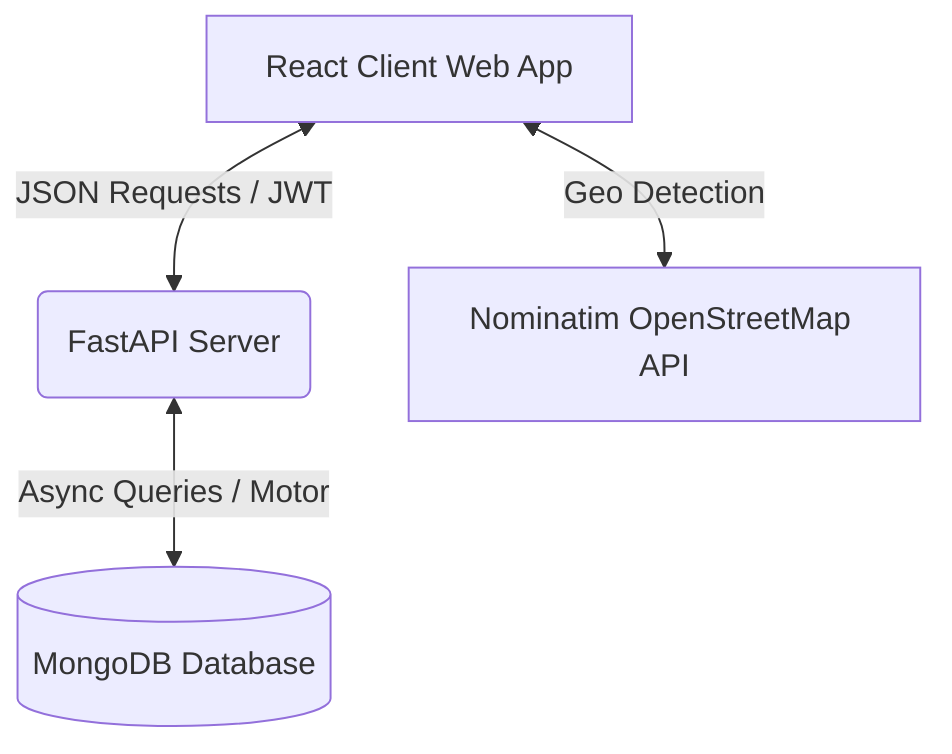

# 🌐 Right Ads Digital — Premium Business Listing Directory

[](https://vitejs.dev/)
[](https://react.dev/)
[](https://tailwindcss.com/)
[](https://fastapi.tiangolo.com/)
[](https://www.mongodb.com/)
[](https://jwt.io/)

A premium, modern, and high-performance local business listing directory website (akin to *Justdial* or *Yelp*) featuring an ultra-sleek React SPA frontend powered by a robust asynchronous FastAPI & MongoDB backend. 

---

## 🎨 Design & UX Highlights

Right Ads Digital has been designed to prioritize visual elegance, seamless interactivity, and speed:
* **Glassmorphic Hero Banner**: Immersive background slide animations (powered by Unsplash CDN) and interactive auto-slider controls.
* **Geolocalized Search**: Integrated Nominatim OpenStreetMap API for automated client-side pincode and city detection.
* **Smooth Micro-Animations**: Built with Framer Motion to provide high-end, responsive card hover states, fade-in loading, and active transitions.
* **Responsive Layouts**: Completely responsive grids tailored perfectly from mobile screen widths up to 1280px desktops.

---

## ⚙️ Core Technology Stack

This application is built with a decoupled architecture utilizing industry-standard technologies:

### 💻 Frontend Client (Vite + React SPA)
* **[React v19.2.6](https://react.dev/)**: Component-driven UI development with optimal reactivity and virtual DOM rendering.
* **[Vite v8.0.12](https://vitejs.dev/)**: Next-generation frontend tooling providing extremely fast Hot Module Replacement (HMR) and builds.
* **[Tailwind CSS v4.3.1](https://tailwindcss.com/)**: Utility-first CSS framework with dynamic compiled runtime engine for beautiful layout aesthetics.
* **[Framer Motion](https://www.framer.com/motion/)**: Fluid animations and micro-interactions for enhanced feedback.
* **[Axios](https://axios-http.com/)**: Promise-based HTTP client for seamless API requests to the backend.
* **[Lucide React](https://lucide.dev/)**: Clean, modern, and light SVG icon set.
* **[React Hot Toast](https://react-hot-toast.com/)**: Sleek, non-intrusive notifications for user feedback.

### 🔌 Backend API Server (FastAPI)
* **[FastAPI v0.111.0](https://fastapi.tiangolo.com/)**: High-performance, asynchronous web framework for building APIs with Python.
* **[Uvicorn v0.29.0](https://www.uvicorn.org/)**: Lightning-fast ASGI web server implementation.
* **[Pydantic v2](https://docs.pydantic.dev/)**: Data validation and settings management using Python type annotations.
* **[JWT & Python-Jose](https://jwt.io/)**: Secure JSON Web Token-based stateless authentication protocols.
* **[Bcrypt & Passlib](https://passlib.readthedocs.io/)**: Industry-standard cryptographic secure password hashing and verification.

### 💾 Database (MongoDB)
* **[MongoDB Community / Atlas](https://www.mongodb.com/)**: Scalable document-based NoSQL database.
* **[Motor v3.4.0](https://motor.readthedocs.io/)**: Asynchronous MongoDB driver for Python (enabling non-blocking FastAPI integration).

---

## 🏗️ Architecture Overview



### Port Mapping & Connections

| Component | Target URL / Address | Protocol / Driver |
| :--- | :--- | :--- |
| **Frontend App** | `http://localhost:5173` | HTTP (Vite Dev Server) |
| **Backend API** | `http://localhost:8000` | REST API (Uvicorn / FastAPI) |
| **Interactive Docs** | `http://localhost:8000/docs` | Swagger OpenAPIs |
| **Database Engine** | `mongodb://localhost:27017` | MongoDB Community Server / Atlas |

---

## 📂 Project Structure

```text
├── backend/
│   ├── app/
│   │   ├── auth/          # Password hashing, user validation, and JWT generation
│   │   ├── models/        # Pydantic schemas (Data validation & Serialization)
│   │   ├── routers/       # Route endpoints (Auth, Admin, Businesses, Leads, Categories, Stats)
│   │   ├── config.py      # App configurations (.env file loader)
│   │   ├── database.py    # Asynchronous MongoDB Connection Setup (Motor Client)
│   │   ├── main.py        # FastAPI Initialization, CORS middleware, and Lifespan seeding
│   │   └── seed.py        # Automated Database Seeder (Seeds categories, admin, and test listings)
│   ├── requirements.txt   # Backend Pip Dependencies
│   └── run.py             # Server runner script
│
├── Frontend/
│   ├── src/
│   │   ├── components/    # Common UI elements (Navbar, Footer, Skeletons, Business Cards)
│   │   ├── context/       # Auth state sharing context across the React app
│   │   ├── data/          # Frontend static mock structures and assets
│   │   ├── pages/         # Screen views (Home, CategoryBrowse, Dashboard, Admin, Search)
│   │   ├── services/      # Axios endpoints connecting directly to Backend router services
│   │   └── App.jsx        # Routing configuration & client entry
│   ├── package.json       # React dependencies and scripts
│   └── vite.config.js     # Bundler configuration
```

---

## 🚀 Quick Start Guide

### 📋 Prerequisites

Before running the application, make sure you have the following installed on your machine:
* **Node.js** (v18.0 or higher) & **npm** (v9.0 or higher)
* **Python** (v3.9 or higher)
* **MongoDB** (Running locally on port `27017`, or use an Atlas Cloud connection string)

---

### 🐍 Step 1: Start the Backend Server (FastAPI)

1. **Navigate to the backend directory**:
   ```bash
   cd backend
   ```

2. **Configure your environment**:
   Create a `.env` file in the `backend` folder (or copy and update the existing one):
   ```env
   MONGO_URI=mongodb://localhost:27017
   DB_NAME=nearlly_db
   SECRET_KEY=your_access_secret_key
   REFRESH_SECRET_KEY=your_refresh_secret_key
   ALGORITHM=HS256
   ACCESS_TOKEN_EXPIRE_MINUTES=30
   REFRESH_TOKEN_EXPIRE_DAYS=7
   ADMIN_EMAIL=admin@rightads.digital
   ADMIN_PASSWORD=Admin@123
   ```

3. **Set up a Virtual Environment**:
   * **Windows (PowerShell)**:
     ```powershell
     python -m venv venv
     .\venv\Scripts\Activate.ps1
     ```
   * **Windows (CMD)**:
     ```cmd
     python -m venv venv
     call venv\Scripts\activate.bat
     ```
   * **macOS / Linux**:
     ```bash
     python3 -m venv venv
     source venv/bin/activate
     ```

4. **Install Dependencies**:
   Ensure your pip packages are updated and install the requirements:
   ```bash
   pip install --upgrade pip
   pip install -r requirements.txt
   ```

5. **Run the Server**:
   Start the FastAPI server via Uvicorn:
   ```bash
   python run.py
   python -m uvicorn main:app --host 0.0.0.0 --port 8000 --reload
   ```
   The backend API will start running at **`http://localhost:8000`**.

> [!NOTE]
> On the first startup, the server automatically triggers `seed.py` and populates the database with 19 initial categories, default admin logins, local businesses, and test leads so you can explore immediately!

---

### 💻 Step 2: Start the Frontend Client (React + Vite)

1. **Navigate to the Frontend directory**:
   Open a new terminal window at the project root and run:
   ```bash
   cd Frontend
   ```

2. **Configure Frontend Environment**:
   Ensure you have a `.env` file in the `Frontend` folder containing:
   ```env
   VITE_API_URL=http://localhost:8000/api
   ```

3. **Install Node Modules**:
   Install the required NPM packages:
   ```bash
   npm install
   ```

4. **Launch the Development Server**:
   ```bash
   npm run dev
   ```
   The frontend application will boot up and be accessible at **`http://localhost:5173`**.

---

## 🔐 Pre-seeded Admin Credentials

Log in using the pre-seeded credentials to access administrative dashboard capabilities:

> [!IMPORTANT]
> * **Admin Email**: `admin@rightads.digital`
> * **Admin Password**: `Admin@123`
> 
> *To access the admin suite: Sign in with the details above, click your profile avatar in the navigation bar, and select **Admin Panel**.*

---

## 🧪 Verification & Testing

* **API Swagger Sandbox**: Visit [http://localhost:8000/docs](http://localhost:8000/docs) to visually inspect and test API routes.
* **API ReDoc Spec**: Alternate clean documentation is available at [http://localhost:8000/redoc](http://localhost:8000/redoc).
* **Verify Client Connection**: Search for `"Tikka & Curry"` under `"Hyderabad"` or browse the `"Restaurants"` category to ensure correct MongoDB querying and API connectivity.
